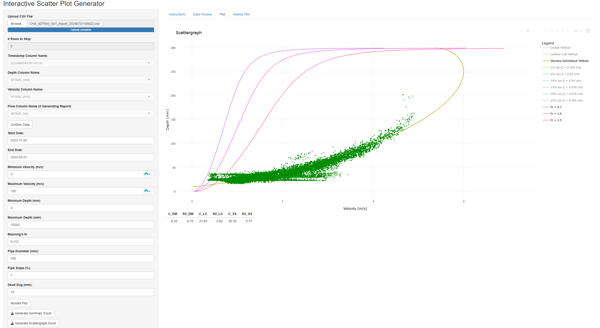

# Scattergraph App

A Shiny-based web application for analyzing sewer flow data. The app processes CSV time-series data containing depth, velocity, and (optionally) flow measurements to generate interactive visualizations for hydraulic engineering analysis. The app also calculates and displays various curves such as froude curves, iso-flow curves, and regression fit curves. Engineers use the relationship between the data and these curves to categorize the sewer's performance.

## Screen Recording
<i>Interactive web application interface.</i>


<i>Weekly analysis visualization.</i>


## Installation and Setup Instructions

### Requirements
- R (version 4.0+)
- Required R packages:
  - shiny
  - shinyjs
  - plotly
  - tidyverse
  - testthat

### Clone this repository
```powershell
git clone https://github.com/alexwhoover/scattergraph_app.git
cd scattergraph_app
```

### Install Required Packages
```r
install.packages(c("shiny", "shinyjs", "plotly", "tidyverse", "testthat"))
```

### To Run the Application
1. Start R Shell
2. Set working directory to the app folder:
```r
setwd("app")
```
3. Run the Shiny application:
```r
source("app.R")
```
Alternatively, open app.R in RStudio and click "Run App"

## Features

- **Data Upload**: Support for multiple CSV file formats with sewer flow monitoring data
- **Multiple Regression Methods**: 
  - Implements the three most common curve fitting methods for sewer depth-velocity data for circular pipes
    - Design Method (DM)
    - Lanfear-Coll Method (LC)
    - Stevens-Schutzback Method (SS)
- **Interactive Filtering**: Date range, velocity, and depth filtering
- **Statistical Analysis**: R² calculation displayed for each regression method
- **Weekly Analysis**: Time-series visualization and weekly data breakdown
- **Excel Export**: Generate summary reports and scattergraph data in legacy Excel formats

## Data Format

Input CSV files should contain:
- Timestamp column (YYYY-MM-DD HH:MM:SS format)
- Depth measurements (millimeters)
- Velocity measurements (m/s)
- Flow measurements (L/s, optional, used only in Excel exports)

Sample data files are provided in `data/sample_inputs/` for testing.

## Reflection

- **Context**: I completed this project during my employment with the City of Vancouver. The final web application was used by myself and others to more efficiently review large datasets of sewer monitoring data to determine pipe network performance. I chose to write the project using R, as the other members of my team came from an academic background and were most familiar with it. As such, they were more comfortable reviewing the code and trusting its use. 
- **Goal**: To develop a tool to more efficiently review sewer monitoring data.
- **Challenges**: Implementing custom regression fitting techniques specific to municipal engineering. Testing outputs matched legacy excel spreadsheet answers.
- **Skills Learned**:
    - **Reactivity**, as this is the essential concept in RShiny
    - **RShiny** for simple interactive web application / dashboard development
    - **Implementing Engineering Formulas** in code and testing outputs
- **Future Improvements**: 
    - In future, I plan to refactor more logic in server.R to other files. I wrote the majority of this code early in my Computer Science learning and have since learned cleaner ways to break up the logic.
    - Plotly graphs load slowly for user, this could be optimized further.